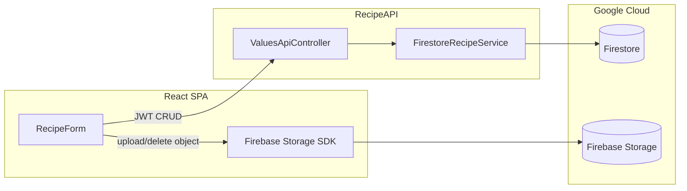
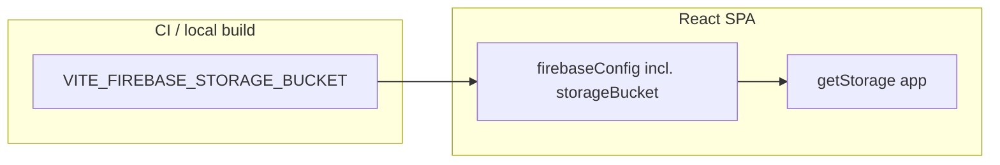

# Tech Spec — Recipe completed photo (optional)

> AIDLC Design phase: [docs/AIDLC.md](../../docs/AIDLC.md) — Phase 2 Design.  
> **Product input:** [product-spec.md](./product-spec.md) (issue [queen-of-code/alexa-recipe-app#67](https://github.com/queen-of-code/alexa-recipe-app/issues/67)).

| Field | Value |
|-------|-------|
| **Unit** | Single unit: optional completed-dish image end-to-end (Firestore metadata + object storage + React UI). |
| **Tracker** | Same as Product Spec |
| **AIDLC feature folder** | `feature/recipe-completed-photo/` |

## Units / scope

**In scope**

- One optional **completed-dish** image per recipe (cardinality per Product Spec).
- **Web app only:** add / replace / remove on **create** and **edit** (`RecipeApp/frontend` — `RecipeForm.jsx`, `recipeApi.js`).
- Persist a **stable reference** on the recipe document so list/detail views can render the image without re-uploading.
- **Per-user isolation:** only the owning Firebase UID can read/write their recipe’s image; API routes continue to enforce `userId` ↔ token UID (existing `ValuesApiController.EnsureRouteUserMatchesToken`).

**Out of scope** (per Product Spec)

- Voice/Alexa upload, galleries, video, step images, social/public URLs, OCR/ML, heavy image editing.

**Repo reality (grounding)**

- **RecipeAPI** uses **Firestore** (`RecipeApp/RecipeAPI/FirestoreModels/Recipe.cs`, `FirestoreRecipeService`) under `users/{userId}/recipes/{recipeId}`, not DynamoDB (see `RecipeApp/specs/architecture.md` — treat Dynamo wording as legacy for recipe CRUD).
- **Frontend** uses **Firebase Auth** (`RecipeApp/frontend/src/firebase.js`) and **JSON** calls to `RecipeAPI` with Bearer ID tokens (`RecipeApp/frontend/src/api/recipeApi.js`).
- **Firebase Storage** is wired via `getStorage(app)` in `RecipeApp/frontend/src/firebase.js`, but the **`firebaseConfig` object omits `storageBucket`**. In production builds, `getStorage()` then fails with **`storage/no-default-bucket`** when the upload path runs ([queen-of-code/alexa-recipe-app#76](https://github.com/queen-of-code/alexa-recipe-app/issues/76)).

## Architecture and components



**Design review — architecture**

- **Metadata in Firestore, bytes in Storage:** Keeps recipe documents small, avoids base64-in-JSON, and matches Firebase’s usual pattern. Recipe document holds a **download URL** or **Storage path** string the client can turn into a display URL (prefer **path** if you want to revoke tokens later; **download URL** is simpler for v1 — pick one in Build and stay consistent).
- **Auth boundary:** RecipeAPI already verifies Firebase JWTs. Storage access must use **Firebase Storage Security Rules** so users cannot read/write another user’s `users/{otherUid}/...` tree.
- **Create flow dependency:** Today `POST /api/values/{userId}` returns `200 OK` with **no body** (`ValuesApiController.Post`), while the server assigns a new `recipeId` when the client omits it (`FirestoreRecipeService.SaveItem`). To attach an image **on first save**, the client needs the **server-assigned `recipeId`** before uploading to a deterministic Storage path. **Required contract change:** `POST` should return **201 Created** (or 200 with body — prefer 201) and a JSON body containing at least `{ "recipeId": "<id>", ... }` or the full external recipe shape. Build implements this without breaking clients that ignore the body.

**Design review — backend (RecipeAPI + Core)**

- Extend **`RecipeApp.Core.ExternalModels.RecipeModel`** with an optional JSON field, e.g. `completedImageUrl` or `completedImageStoragePath` (name aligned with JSON camelCase used elsewhere).
- Extend **`RecipeApp/RecipeAPI/FirestoreModels/Recipe.cs`** with matching `[FirestoreProperty]`; map in constructor and `GenerateExternalRecipe()`.
- **Validation:** Reject save if the field is non-null but fails basic checks (e.g. wrong prefix if using canonical paths, or URL not under allowed host). Keep rules minimal for v1: optional string, max length, allowed content types enforced primarily at upload time.
- **Delete recipe:** When `DeleteRecipe` succeeds, **orphan cleanup:** delete Storage object if path/URL is known (RecipeAPI can use **Firebase Admin SDK** `StorageClient` or HTTP delete via signed operation — choose one library pattern in Build). If delete fails, log and still remove Firestore document (eventual orphan acceptable for tutorial tier; document in ops).

**Design review — frontend**

- Initialize **`getStorage`** from the same Firebase app as Auth (`RecipeApp/frontend/src/firebase.js`); support emulator if the project adds `VITE_USE_STORAGE_EMULATOR` (optional for v1).
- **RecipeForm:** file input (`accept="image/jpeg,image/png,image/webp"`), preview, remove control, disabled state during upload, error surfacing. Do not block submit on image failure if user did not select a file; if they did, either transactional UX (“recipe saved but image failed — retry”) or block until both succeed — **recommend:** save recipe first (after contract returns `recipeId`), then upload, then `PUT` with image field; show clear rollback message if upload fails after recipe exists.
- **RecipeList / detail:** show thumbnail when field present; **decorative** `img` with empty `alt` or `alt=""` if name is adjacent (Product Spec: text remains primary). Lazy-load images if trivial.

## API / UI contracts

### REST (RecipeAPI) — existing routes

| Method | Route | Change |
|--------|-------|--------|
| `POST` | `/api/values/{userId}` | Response body **must** include assigned `recipeId` (and other fields as needed) on success. |
| `PUT` | `/api/values/{userId}/{recipeId}` | Accept optional completed-image field in JSON body. |
| `GET` | `/api/values/{userId}`, `/api/values/{userId}/{recipeId}` | Include optional completed-image field when set. |

**JSON (camelCase)** — illustrative field name (finalize in Build):

```json
{
  "completedImageUrl": "https://firebasestorage.googleapis.com/..."
}
```

Or storage-relative path + client-side URL resolution — document the chosen representation in code comments and OpenAPI/README if added later.

### Firebase Storage layout (recommended)

`users/{firebaseUid}/recipes/{recipeId}/completed{extension}`

- **Replace:** overwrite same logical key or use version suffix; simplest is **delete old object** then upload new after successful `PUT` of metadata.
- **Remove:** delete object + `PUT` with `null`/omit field per convention chosen in Build.

### Limits (abuse / storage)

| Constraint | Suggested default |
|------------|-------------------|
| Max file size | 5 MiB (configurable constant) |
| Allowed MIME | `image/jpeg`, `image/png`, `image/webp` |
| Count | 1 object per recipe (enforced by path + workflow) |

Enforce in **client** before upload and in **Storage rules** (max size / content type). Optional: **RecipeAPI** validation on the string field only (not full binary scan).

### UI contracts

- **Create:** optional file; recipe can save with no file unchanged.
- **Edit:** show current image if present; actions: **Replace** (new file), **Remove** (clear + delete blob).
- **List:** small thumbnail next to recipe name when URL/path present.

## Data model

**Firestore document** (`Recipe` entity): add optional string property for completed image (URL or Storage path). No migration required for existing documents (missing field = no image).

**No change** to MySQL / Identity for this feature.

## Acceptance criteria (for Review)

Traceable to Product Spec success criteria:

| # | Criterion | Review evidence |
|---|-----------|-----------------|
| A1 | Create recipe **with** optional image; same image visible on subsequent load | E2E or manual script + unit tests on mapping |
| A2 | Edit: add image to recipe without one; replace; remove with empty state | Same |
| A3 | User A cannot access User B’s image (Storage rules + API Forbid on wrong `userId`) | Rule tests or documented manual matrix |
| A4 | Create/edit **without** image unchanged | Regression tests on existing flows |
| A5 | Field appears in **GET** list/detail payloads when set | API contract tests |

## Testing approach (Build + Test)

- **Unit:** `Recipe` ↔ `RecipeModel` round-trip for new field; controller deserialization with/without field.
- **Integration:** Firestore emulator save/retrieve with image field; optional Storage emulator upload if configured in CI.
- **Frontend:** extend `RecipeForm.test.jsx` — file input presence, submit payload includes image URL after mock upload, remove clears field.
- **Manual / Validate:** checklist in Product Spec table (multi-user sanity on hosted Firebase).

## Risks and edge cases

| Risk | Mitigation |
|------|------------|
| Large images / mobile bandwidth | Client-side resize/compress optional stretch goal; hard cap in rules |
| Orphan Storage after failed PUT | Retry UX; background cleanup job out of scope |
| POST body change breaks unknown clients | Additive JSON response; existing clients that only check status may still work |
| Emulator parity | Document Firebase emulator suite for Auth + Firestore + Storage for local dev |

## Specialist review summary

- **Architecture:** Metadata/blobs split; contract fix for POST `recipeId`; Storage rules for tenant isolation.
- **Backend-saas:** JWT-bound CRUD unchanged; validate image metadata shape; cleanup on delete.
- **Frontend-web:** Accessible list/detail; progressive enhancement when image missing; clear upload errors.

---

## Addendum — Unit: Default Firebase Storage bucket (production fix)

> **Tracker:** [queen-of-code/alexa-recipe-app#76](https://github.com/queen-of-code/alexa-recipe-app/issues/76) — web-only; completes the Storage path assumed by this Tech Spec’s main unit.  
> **Product input:** Same folder — [product-spec.md](./product-spec.md) (completed-photo outcomes); issue #76 is an **engineering defect** against those outcomes on hosted web.

| Field | Value |
|-------|-------|
| **Unit / scope** | Ensure the SPA’s Firebase app is initialized with a **valid default Storage bucket** so `getStorage(app)` resolves and recipe image upload/save succeeds on production. |
| **AIDLC feature folder** | `feature/recipe-completed-photo/` |

### Context

**Symptom:** On Firebase Hosting (`qoc-recipe-app`), after choosing an image on recipe create/edit, save fails with:

`Firebase Storage: No default bucket found. Did you set the 'storageBucket' property when initializing the app? (storage/no-default-bucket)`

**Root cause:** `RecipeApp/frontend/src/firebase.js` passes only `apiKey`, `authDomain`, `projectId`, and `appId` into `initializeApp()`. The Firebase JS SDK requires **`storageBucket`** (or a bucket passed explicitly to `getStorage`) to select the default bucket.

**Non-goals for this unit:** Alexa/voice, API/Firestore schema changes, Storage security rules redesign, or new product behaviors beyond “upload works as already specified” in the main unit.

### Architecture (design review)

- **Single client config surface:** Continue one Firebase app for Auth + Storage; add **`storageBucket`** to the same `firebaseConfig` object so `getStorage(app)` uses the project’s default bucket.
- **Bucket identity:** Must match the **default bucket** shown in Firebase Console → Project → Storage (typically `<project-id>.appspot.com` for the default bucket). For `projectId` `queen-of-code`, the conventional default is **`queen-of-code.appspot.com`** — **verify in console** before relying on convention alone (custom bucket names are possible).
- **Configuration layering:** Prefer **`VITE_FIREBASE_STORAGE_BUCKET`** injected at build time (same pattern as other `VITE_FIREBASE_*` vars) so staging/custom projects can override without code changes. Optional fallback in code: if the env var is unset, derive `import.meta.env.VITE_FIREBASE_PROJECT_ID + '.appspot.com'` only if product/engineering agrees that convention is always valid for this app—**default recommendation is explicit env only** for predictability.



### Integration points

| System | Contract | Notes |
|--------|----------|-------|
| Firebase (client) | `initializeApp({ …, storageBucket })` | Required for default `getStorage(app)` |
| GitHub Actions | `env` for `npm run build` in `RecipeApp/frontend` | Add `VITE_FIREBASE_STORAGE_BUCKET` to **`.github/workflows/main.yml`** (`build_frontend`) and **`.github/workflows/prod_deploy.yml`** (`Build frontend`) alongside existing `VITE_FIREBASE_*` keys |
| Local dev | `RecipeApp/frontend/.env.local` (from **`.env.local.example`**) | Document example value; align with team Firebase project |
| Secrets (optional) | GitHub `secrets.VITE_FIREBASE_STORAGE_BUCKET` | Bucket hostname is **not highly sensitive** (public in client bundle); a **repository variable** or **inline literal** matching console is acceptable if org policy allows—use a secret only for consistency with other Firebase web config |

### Data & APIs

- **No** Firestore or RecipeAPI changes for this unit.

### UI / client (frontend design review)

- **File:** `RecipeApp/frontend/src/firebase.js` — add `storageBucket: import.meta.env.VITE_FIREBASE_STORAGE_BUCKET` (or validated equivalent) to `firebaseConfig`.
- **Emulator:** Existing `VITE_USE_STORAGE_EMULATOR` + `connectStorageEmulator` path remains; ensure production builds still set `storageBucket` so non-emulator uploads work.
- **Failure mode:** If the env var is missing in a given environment, fail fast at runtime with a clear error—or document that CI must fail the build when required env is empty (Build choice; prefer CI guard so production never ships without bucket).

### Security & privacy

- **No new secrets requirement**; `storageBucket` is a public hostname in the client. Continue to rely on **Firebase Auth** and **Storage security rules** (defined in the main unit) for authorization.
- Do **not** embed private keys or service accounts in the SPA.

### Acceptance criteria (for Review) — addendum unit

| # | Criterion | Review evidence |
|---|-----------|-----------------|
| B1 | Production (or staging) build includes `storageBucket` in compiled Firebase config | Built artifact inspection or documented env matrix |
| B2 | Signed-in user can complete recipe save **with** image upload on hosted web without `storage/no-default-bucket` | Manual Validate step or screen recording; matches issue #76 repro gone |
| B3 | Recipe save **without** image unchanged | Regression on existing flow |
| B4 | CI frontend job supplies `VITE_FIREBASE_STORAGE_BUCKET` so `npm run build` does not regress | Green `build_frontend` on PR |
| B5 | `.env.local.example` documents the new variable for local onboarding | Doc diff |

### Testing approach (Build + Test)

| Layer | What we prove | Notes |
|-------|----------------|-------|
| CI | Frontend production build succeeds with new env | `main.yml` `build_frontend` |
| Manual | Upload on `qoc-recipe-app` (or release candidate URL) after deploy | Close loop for issue #76 |
| Optional | Unit test or small module test that `firebaseConfig` includes `storageBucket` when env is set | Only if existing test patterns support env mocking without flakiness |

### Rollout & operations

- **Rollout:** Ship with the next frontend deploy (Firebase Hosting). Coordinate **GitHub Actions** / repository settings so `VITE_FIREBASE_STORAGE_BUCKET` is set **before** or **with** the deploy that contains the code change.
- **Firebase Console:** Confirm **Storage** is enabled and the bucket name used in config matches the default bucket for the project.
- **Rollback:** Revert the commit and redeploy prior Hosting version if misconfiguration causes client errors; no database migration.

### Risks & edge cases

| Risk | Mitigation |
|------|------------|
| Wrong bucket string | Copy from Firebase Console; smoke-test upload after deploy |
| Typo in workflow env | CI build catches missing reference if code requires the var |
| Multiple Firebase projects | Per-environment `VITE_FIREBASE_STORAGE_BUCKET` values |

### Specialist review summary (addendum)

- **Architecture:** Minimal change—complete Firebase web config; no new services.
- **Backend-saas:** Not applicable; no API work.
- **Frontend-web:** Align with Firebase JS v9+ modular init; keep emulator path intact.
- **DevOps:** Extend `main.yml` and `prod_deploy.yml` frontend build `env`; document `.env.local.example`.

## Human approval

- [ ] Engineering approved before Build (main unit — completed photo)
- [ ] Engineering approved before Build (addendum unit — issue #76 Storage bucket config)
