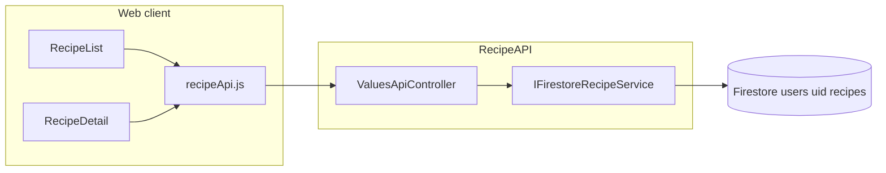

# Tech Spec — `recipe-favoriting`

> AIDLC Design phase: [docs/AIDLC.md](../../docs/AIDLC.md) — Phase 2 Design. Product Spec: [product-spec.md](./product-spec.md).

## Overview

| Field | Value |
|-------|-------|
| **Unit / scope** | Single Unit: per-user recipe favorites — persistence, API, list ordering, favorites-only filter, list + detail UI. |
| **Feature** | `feature/recipe-favoriting/` — [queen-of-code/alexa-recipe-app#71](https://github.com/queen-of-code/alexa-recipe-app/issues/71) |
| **Product Spec** | [product-spec.md](./product-spec.md) |
| **Status** | Draft — pending engineering approval |
| **Author** | AIDLC Design agent (headless run) |
| **Created** | 2026-04-28 |
| **Last updated** | 2026-04-28 |

## Units / scope

**Single Unit** — same boundaries as Product Spec:

- **Backend (`RecipeAPI`):** Persist `IsFavorite` on each user-scoped recipe document in Firestore; expose it on `RecipeModel`; support read paths that return **favorites-first** ordering and optional **favorites-only** filtering; dedicated endpoints to set/clear favorite without sending a full recipe payload.
- **Frontend:** Recipe list and recipe detail show favorite affordance; toggle calls API; list supports **favorites-only** mode and applies **favorites-first** ordering in default “all recipes” view; empty states per Product Spec.
- **Explicit non-goals:** Alexa/voice changes, social/public recipes, drag-and-drop ordering within the favorites group, meal-plan “favorite” concepts (`Meal.FavoriteOfUsers` remains unrelated).

Out of scope for this Unit: changing ingredient search matching rules (reuse existing `POST .../search`); new ADR unless repo policy later requires one for Firestore field rollout.

## Context

### Existing system & documentation

- Recipes live under Firestore `users/{userId}/recipes/{recipeId}` via [`FirestoreRecipeService`](../../RecipeApp/RecipeAPI/FirestoreRecipeService.cs) and [`Recipe`](../../RecipeApp/RecipeAPI/FirestoreModels/Recipe.cs).
- HTTP surface is [`ValuesApiController`](../../RecipeApp/RecipeAPI/Controllers/ValuesApiController.cs) at `api/values` with Firebase JWT (`EnsureRouteUserMatchesToken`).
- External DTO: [`RecipeModel`](../../RecipeApp/Core/ExternalModels/RecipeModel.cs) (JSON camelCase via `JsonPropertyName`).
- Web app: [`RecipeList.jsx`](../../RecipeApp/frontend/src/recipes/RecipeList.jsx), [`RecipeDetail.jsx`](../../RecipeApp/frontend/src/recipes/RecipeDetail.jsx), [`recipeApi.js`](../../RecipeApp/frontend/src/api/recipeApi.js).
- **Non-canonical sketch:** [`RecipeApp/specs/recipe-favoriting.md`](../../RecipeApp/specs/recipe-favoriting.md) assumed DynamoDB — **do not** follow; this Tech Spec supersedes it for Firestore.

### Architecture review pass

- **Layering:** Keep Firestore access in `IFirestoreRecipeService` / `FirestoreRecipeService`; controller stays thin (validate auth, map DTOs, delegate). Optional small helper for “sort recipes for list response” to keep ordering rules testable in isolation.
- **Consistency:** Favorites are **recipe-scoped** under the same user document tree as today — no separate “favorites collection” in v1 (avoids sync/join complexity).

### Backend / SaaS review pass

- **AuthZ:** All routes continue to require route `userId` == Firebase UID; no cross-user reads/writes.
- **Idempotency:** Setting favorite on an already-favored recipe (and clearing when already cleared) should succeed without error.

### Frontend review pass

- **Accessibility:** Favorite control is a **toggle button** (or `role="switch"`) with visible state (e.g. filled vs outline icon) and an accessible name, e.g. “Add to favorites” / “Remove from favorites” or `aria-pressed`.
- **State:** After toggle, update local state optimistically or refetch single recipe / list — choose one pattern and keep error handling (revert or toast) documented for Build.

## Architecture and components

| Area | Proposal |
|------|----------|
| **Persistence** | Add **`IsFavorite`** (`bool`) to Firestore `Recipe` and to `RecipeModel`. Default **`false`** when the field is missing on legacy documents (see Data model). |
| **Write path** | Implement **`SetFavorite(userId, recipeId, bool)`** (or equivalent) on `IFirestoreRecipeService`: load recipe, set flag, save via existing `SaveRecipe` / `SetAsync` path so `LastUpdateTime` and validation stay centralized. |
| **Read — list** | `GET /api/values/{userId}` applies optional query filter `favoritesOnly=true`, then **sorts** the result: **all favorited recipes first, then non-favorited**. Within each group, sort by **`lastUpdated` descending** (uses `Recipe.LastUpdateTime` / `RecipeModel.LastUpdateTime`) for stable, predictable ordering. |
| **Read — detail** | `GET /api/values/{userId}/{recipeId}` returns recipe with `isFavorite` populated. |
| **Ingredient search** | `POST /api/values/{userId}/search` returns recipes with `isFavorite` on each row. **Combination rule:** Favorites-only is a **client-side** filter on that result set (and on the full list). Sort **favorites-first** when presenting search results the same way as the main list (see API section). |
| **Meals vs recipes** | Do **not** use or extend `Meal.FavoriteOfUsers` for this feature — naming overlap only; scope is **recipes** only. |

## API / UI contracts

### HTTP (Firebase JWT — unchanged)

**1. List recipes (extended)**

`GET /api/values/{userId}?favoritesOnly={true|false}`

- **`favoritesOnly` omitted or `false`:** Return **all** recipes for the user, sorted **favorites first**, then non-favorites; within each bucket **`lastUpdated` descending**.
- **`favoritesOnly=true`:** Return only recipes where `isFavorite` is true, sorted by **`lastUpdated` descending**.
- Response: JSON array of `RecipeModel` including **`isFavorite`** on each object.

**2. Get one recipe**

`GET /api/values/{userId}/{recipeId}`

- Response includes **`isFavorite`**.

**3. Set / clear favorite (dedicated sub-resource)**

Preferred shape (matches common REST patterns and avoids overloading full `PUT` body):

- `PUT /api/values/{userId}/{recipeId}/favorite` — body: `{ "favorite": true }` (or minimal JSON); sets favorite **on** for that recipe.
- `DELETE /api/values/{userId}/{recipeId}/favorite` — removes favorite (sets **off**).

Alternatives acceptable if Build prefers: `PATCH` with `{ "isFavorite": boolean }` on the same path — document the chosen verb + body in implementation and tests.

- **Auth:** Same as existing routes; `403` if token UID ≠ `userId`.
- **Errors:** `404` if recipe does not exist; `400` for malformed body when applicable.

**4. Ingredient search (existing)**

`POST /api/values/{userId}/search` — unchanged request shape; response recipes include **`isFavorite`**. Controller applies **favorites-first** ordering to the filtered list before returning (same comparator as GET list). Client applies **favorites-only** toggle when ingredient filter is active by filtering the returned array.

### JSON field

Add to `RecipeModel` (and Firestore `Recipe`):

- `isFavorite` — boolean.

### Frontend

| Location | Behavior |
|----------|----------|
| **`recipeApi.js`** | Functions: e.g. `setFavorite(userId, recipeId)`, `clearFavorite(userId, recipeId)` → PUT/DELETE; extend `getAllRecipes` to pass `favoritesOnly` query param when needed. |
| **`RecipeList.jsx`** | Toggle **“Show favorites only”** (checkbox or switch). When off, call `getAllRecipes` without filter — API returns favorites-first order. When on, call with `favoritesOnly=true` **or** filter client-side from a full fetch — **prefer query param** to avoid loading non-favorites when the user only wants favorites. When **ingredient search** is active, derive displayed rows from POST results: apply favorites-only filter in memory if the toggle is on; keep favorites-first ordering consistent. |
| **`RecipeDetail.jsx`** | Favorite toggle using same API; reflects `recipe.isFavorite` after load and after toggle. |
| **Empty states** | Favorites-only with zero favorites: dedicated message (Product Spec criterion 5). |

## Data model

| Store | Change |
|-------|--------|
| **Firestore `Recipe` document** | New optional field **`IsFavorite`** (`bool`), `[FirestoreProperty]`. |
| **`RecipeModel`** | New **`IsFavorite`** with `[JsonPropertyName("isFavorite")]`. |
| **Serialization** | `GenerateExternalRecipe` / constructor paths map the field both ways. |
| **Legacy documents** | If `IsFavorite` is missing, treat as **`false`** when materializing `Recipe` (Firestore defaults missing bool to `false` for value types — verify in implementation; if serializer leaves default, document explicit default-after-read if needed). |

**Concurrency:** Last writer wins on recipe saves; favorite toggle uses read-modify-write on the recipe document — acceptable for v1 personal library.

## Security & privacy

- Same guarantees as existing recipe API: data scoped to authenticated user; no leakage across users.
- No new secrets; no PII beyond existing recipe/name content.

## Acceptance criteria (for Review)

- [ ] `RecipeModel` / Firestore `Recipe` carry **`isFavorite`** and it round-trips on create/update/read.
- [ ] `PUT`/`DELETE` `.../favorite` (or documented equivalent) sets/clears favorite; unauthorized `userId` returns **403**.
- [ ] `GET` list without `favoritesOnly` returns **all** recipes with **every favorited row before any non-favorited**; tie-break **lastUpdated desc** within each group.
- [ ] `GET` list with `favoritesOnly=true` returns only favorited recipes.
- [ ] `POST .../search` responses include `isFavorite` and use the same favorites-first ordering as the list endpoint.
- [ ] Web list + detail: user can toggle favorite; after refresh, state matches server.
- [ ] Favorites-only UI shows appropriate empty state when user has no favorites.
- [ ] No use of `Meal.FavoriteOfUsers` for recipe favoriting.

## Testing approach (Build + Test)

| Layer | What to prove |
|-------|----------------|
| **Unit (C#)** | Ordering helper: mixed favorite flags + same/different `LastUpdateTime`; favorites-only filter; optional mapping default for missing `IsFavorite`. |
| **API** | Controller tests with mocked `IFirestoreRecipeService`: favorite endpoints, GET ordering, `favoritesOnly` query, search includes flag + order. |
| **Frontend (Vitest)** | Recipe list: toggling favorites-only calls API with expected query; favorite button interaction; detail toggle updates display (mocked fetch). |
| **Manual** | Sign in, favorite from list and detail, refresh, verify order and filter; combine with ingredient search and favorites-only. |

## Rollout & operations

- **Rollout:** Deploy API + web together; old clients ignore unknown JSON fields; new field defaults false for existing documents.
- **Monitoring:** Optional — log count of favorite toggles only if product wants usage metrics later; not required for v1.
- **Rollback:** Revert deploy; Firestore field may remain unused — harmless.

## Risks and edge cases

| Risk | Mitigation |
|------|------------|
| **Read-modify-write race** on toggle vs concurrent edit | Accept for v1; rare for single-user recipe edits. |
| **`LastUpdateTime` changes when toggling favorite** | Updates “last updated” in UI — acceptable; document for Review. |
| **Ingredient search + favorites-only** | Client filters POST results; document so testers know behavior. |
| **Stale sketch** `RecipeApp/specs/recipe-favoriting.md` | This Tech Spec + implementation supersede; consider deleting or archiving that file in a later cleanup (not part of this Unit). |

## Human approval

- [ ] Engineering approved before Build

## Change history

| Date | Author | Changes |
|------|--------|---------|
| 2026-04-28 | AIDLC Design agent | Initial draft |
